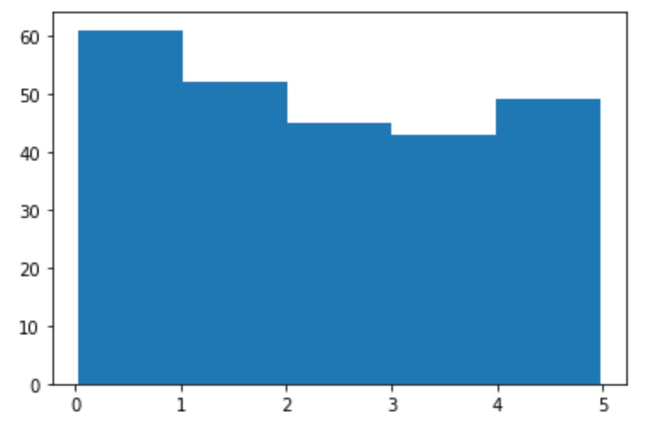

# MACHINE LEARNING

## Getting Started

- Học máy là làm cho máy tính học từ việc nghiên cứu dữ liệu và thống kê.

- Học máy là một bước đi theo hướng của trí tuệ nhân tạo (AI).

- Học máy là một chương trình phân tích dữ liệu và học cách dự đoán kết quả.

### Data set

Đối với máy tính, Data set là bất kỳ tập dữ liệu nào. Nó có thể là bất kỳ thứ gì từ một mảng đến từ một cơ sở dữ liệu hoàn chỉnh.

Ví dụ về một mảng:

```PYthon
[99,86,87,88,111,86,103,87,94,78,77,85,86]
```
Ví dụ về cơ sở dữ liệu:

Bằng cách nhìn vào mảng, chúng ta có thể đoán rằng giá trị trung bình có thể là khoảng 80 hoặc 90 và chúng ta cũng có thể xác định giá trị cao nhất và giá trị thấp nhất, nhưng chúng ta có thể làm gì khác?

Và bằng cách nhìn vào cơ sở dữ liệu, chúng ta có thể thấy rằng màu phổ biến nhất là màu trắng, và chiếc xe lâu đời nhất là 17 năm, nhưng điều gì sẽ xảy ra nếu chúng ta có thể dự đoán nếu một chiếc xe có AutoPass, chỉ bằng cách nhìn vào các giá trị khác?

Đó là công dụng của Học máy! Phân tích dữ liệu và dự đoán kết quả!

Trong Học máy, người ta thường làm việc với các tập dữ liệu rất lớn. Trong hướng dẫn này, chúng tôi sẽ cố gắng làm cho việc hiểu các khái niệm khác nhau của học máy trở nên dễ dàng nhất có thể và chúng tôi sẽ làm việc với các tập dữ liệu nhỏ dễ hiểu.

### Loại dữ liệu

Để phân tích dữ liệu, điều quan trọng là phải biết loại dữ liệu mà chúng ta đang xử lý.

Chúng tôi có thể chia các loại dữ liệu thành ba loại chính:
- Numerical
- Categorical
- Ordinal

Bằng cách biết loại dữ liệu của nguồn dữ liệu của bạn, bạn sẽ có thể biết kỹ thuật nào để sử dụng khi phân tích chúng.

## Mean Median Mode

Chúng ta có thể học được gì khi nhìn vào một nhóm số?

Trong Học máy (và trong toán học) thường có ba giá trị mà chúng ta quan tâm:

- Mean - Giá trị trung bình
- Median - Giá trị điểm giữa
- Mode - Giá trị phổ biến nhất

Ví dụ: Chúng tôi có tốc độ của 13 ô tô:

```Python
speed = [99,86,87,88,111,86,103,87,94,78,77,85,86]
```

### Mean

Mean là giá trị trung bình

Để tính giá trị trung bình, hãy tìm tổng của tất cả các giá trị và chia tổng cho số giá trị:

`(99+86+87+88+111+86+103+87+94+78+77+85+86) / 13 = 89.77`

The NumPy module has a method for this.

```Python
import numpy as np

speed = [99,86,87,88,111,86,103,87,94,78,77,85,86]

x = np.mean(speed)

print(x)
```

### Median

Median là giá trị ở giữa sau khi bạn đã sắp xếp tất cả các giá trị:

77, 78, 85, 86, 86, 86, **87**, 87, 88, 94, 99, 103, 111

Điều quan trọng là các con số phải được sắp xếp trước khi bạn có thể tìm Median.

The NumPy module has a method for this.

```Python
import numpy as np

speed = [99,86,87,88,111,86,103,87,94,78,77,85,86]

x = np.median(speed)

print(x)
```

Nếu có hai số ở giữa thì trung bình tổng hai số đó.

77, 78, 85, 86, 86, **86**, **87**, 87, 94, 98, 99, 103

(86 + 87) / 2 = **86.5**

### Mode


```Python
from scipy import stats 

speed = [99,86,87,88,111,86,103,87,94,78,77,85,86]

x = stats.mode(speed)

print(x)
```

## Standard Deviation

- Độ lệch chuẩn là một số mô tả mức độ trải rộng của các giá trị.

- Độ lệch chuẩn thấp có nghĩa là hầu hết các con số đều gần với giá trị trung bình (Mean).

- Độ lệch chuẩn cao có nghĩa là các giá trị được trải ra trên một phạm vi rộng hơn.

Ví dụ: Chúng tôi có tốc độ của 7 ô tô:

`speed = [86,87,88,86,87,85,86]`

Độ lệch chuẩn là: `0.9` (Có nghĩa là hầu hết các giá trị đều nằm trong phạm vi 0,9 từ giá trị trung bình, là 86,4).

Hãy để chúng tôi làm điều tương tự với lựa chọn các số có phạm vi rộng hơn:

`speed = [32,111,138,28,59,77,97]`

Độ lệch chuẩn là: `37.85` (Có nghĩa là hầu hết các giá trị nằm trong phạm vi 37,85 từ giá trị trung bình, là 77,4).

Như bạn có thể thấy, độ lệch chuẩn cao hơn cho thấy rằng các giá trị được trải ra trên một phạm vi rộng hơn.

The NumPy module has a method to calculate the standard deviation:

```Python
import numpy

speed = [86,87,88,86,87,85,86]

x = numpy.std(speed)

print(x)
```

### Variance

- Phương sai là một con số khác cho biết mức độ dàn trải của các giá trị.

- Trong thực tế, nếu bạn lấy căn bậc hai của phương sai, bạn sẽ có độ lệch chuẩn! Hoặc ngược lại, nếu bạn nhân độ lệch chuẩn với chính nó, bạn sẽ có được phương sai!

Để tính toán phương sai, bạn phải làm như sau:

1. Tìm giá trị trung bình
`(32+111+138+28+59+77+97) / 7 = 77.4`
2. Đối với mỗi giá trị: tìm độ chênh lệch so với giá trị trung bình:
`32 - 77.4 = -45.4`
`111 - 77.4 =  33.6`
`138 - 77.4 =  60.6`
 `28 - 77.4 = -49.4`
 `59 - 77.4 = -18.4`
 `77 - 77.4 = - 0.4`
`97 - 77.4 =  19.6`
3. Đối với mỗi hiệu số: tìm giá trị bình phương:
`(-45.4)^2 = 2061.16`
 `(33.6)^2 = 1128.96`
 `(60.6)^2 = 3672.36`
`(-49.4)^2 = 2440.36`
`(-18.4)^2 =  338.56`
`(- 0.4)^2 =    0.16`
 `(19.6)^2 =  384.16`
4. Phương sai là số trung bình của các bình phương này:
`(2061.16+1128.96+3672.36+2440.36+338.56+0.16+384.16) / 7 = 1432.2`

NumPy có một method để tính toán phương sai:

```Python
import numpy

speed = [32,111,138,28,59,77,97]

x = numpy.var(speed)

print(x)
```

## Percentiles

Phân vị được sử dụng trong thống kê để cung cấp cho bạn một giá trị cho một phần trăm nhất định về số các giá trị thấp hơn.

Ví dụ: Giả sử chúng ta có một loạt các độ tuổi của tất cả những người sống trên một con phố.

`ages = [5,31,43,48,50,41,7,11,15,39,80,82,32,2,8,6,25,36,27,61,31]`

Phân vị 75 là gì? Câu trả lời là 43, nghĩa là 75% dân số 43 tuổi trở xuống.

The NumPy module has a method for finding the specified percentile:

```Python
import numpy

ages = [5,31,43,48,50,41,7,11,15,39,80,82,32,2,8,6,25,36,27,61,31]

x = numpy.percentile(ages, 75)

print(x)
```

## Data Distribution

Trước đó trong hướng dẫn này, chúng tôi đã làm việc với một lượng rất nhỏ dữ liệu trong các ví dụ của chúng tôi, chỉ để hiểu các khái niệm khác nhau.

Trong thế giới thực, các tập dữ liệu lớn hơn nhiều, nhưng có thể khó thu thập dữ liệu trong thế giới thực, ít nhất là ở giai đoạn đầu của một dự án.

Để tạo tập dữ liệu lớn để thử nghiệm, chúng tôi sử dụng mô-đun Python NumPy, đi kèm với một số method để tạo tập dữ liệu ngẫu nhiên, có kích thước bất kỳ.

Thí dụ: Tạo một mảng chứa 250 giá trị ngẫu nhiên từ 0 đến 5:

```Python
import numpy

x = numpy.random.uniform(0.0, 5.0, 250)

print(x)
```

### Histogram

Để trực quan hóa tập dữ liệu, chúng tôi có thể vẽ biểu đồ với dữ liệu chúng tôi thu thập được.

Chúng tôi sẽ sử dụng mô-đun Python Matplotlib để vẽ biểu đồ.

```Python
import numpy
import matplotlib.pyplot as plt

x = numpy.random.uniform(0.0, 5.0, 250)

plt.hist(x, 5)
plt.show()
```



